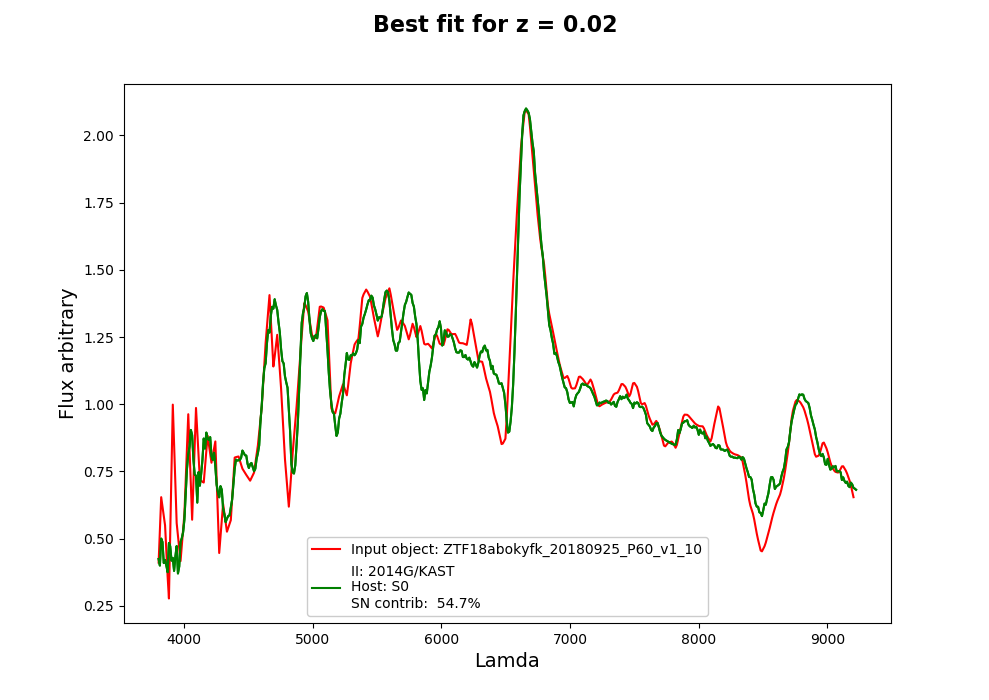

# Welcome to Superfit in Python! :dizzy: :bomb: :boom:

Superfit in python (pySF) is a software for the spectral classification of Supernovae of all major types 

## Requierments

- `numpy`
- `scipy`
- `astropy`
- `astropy extinction`
- `PyAstronomy`
- `pathlib`


# To run one object  
The user must make sure to have a template bank to look at. The new template bank is not in the GitHub because of space limitations, however it can be downloaded from my Dropbox as a zip file, please email me for the Dropbox link.


The user must download the full superfit folder and place the bank inside of it, also any spectra to be analized. The user only changes the parameters from the jason file already withing the folder, the following is an explanation of the parameters. 


## The parameters of the fit 

The user must only change the parameters of the fit from the parameters.json file, the file looks like this (the template for this example is included in the git)

  
    "object_to_fit" : "ZTF18abokyfk_20180925_P60_v1.ascii",


    "z_start": 0,
    "z_end": 0,
    "z_int": 0,

   
    "temp_sn_tr"  : ["IIb-flash", "computed", "Ia 02es-like", "Ia-02cx like", "TDE He", "Ca-Ia", 
                    "Ia-CSM-(ambigious)", "II", "super_chandra", "SLSN-II", "IIn", "FBOT", "Ibn", 
                    "SLSN-IIn", "Ia 91T-like", "IIb", "TDE H", "SN - Imposter", "II-flash", "ILRT", 
                    "Ia 99aa-like", "Ic", "SLSN-I", "Ia-pec", "Ib", "Ia-CSM", "Ia-norm", "SLSN-Ib", 
                    "TDE H+He", "Ia 91bg-like", "Ca-Ib", "Ia-rapid", "Ic-BL", "Ic-pec", "SLSN-IIb"],

    "temp_gal_tr" : ["/E","/S0","/Sa","/Sb","/SB1","/SB2","/SB3","/SB4","/SB5","/SB6","/Sc"],
    
          
    "resolution": 10,

    "lower_lam": 0,
    "upper_lam": 0,
    

    "error_spectrum" : "SG",
    "saving_results_path" : "",

    
    
    "show_plot" : 1,
    "how_many_plots" : 3,

    "minimum_overlap": 0.7,

    "epoch_high": 0,
    "epoch_low" : 0  

    

`"object_to_fit"` : the name or path of the object to analyze, thie should be located within the superfit folder. 

`"z_start"`,`"z_end"`,`"z_int"`: redshift values over which to look for the fit, begining, end and the size of the of intervals in between. In the case of a specific redshift value the user should just make "z_int" equal to 0 and "z_start" into the desired z value.

`"temp_gal_tr"`, `"temp_sn_tr"`: template library folders over which to look in order to find the fit. It is recommended that the user uses the full library as is. 


`"resolution"`: the resolution of the fit, the default is 10Å, however, if the spectra is of lower quality then the fit will be performed automatically at 30Å. 


`"error_spectrum"` : refers to the type of routine used to perform the calculation of the error spectrum. The recommended one is `SG` Savitzky-Golay, there is also the option of `linear` estimation and the option `included` in which the user can use the error spectrum that comes with an object if he wants to, however, this is not recommended. 

`"saving_results_path"`: path in which to save the performed fits, the default one is the superfit folder.
 
 `"show_plot"` : to show the plotted fit or no, the default being 1, to show. 
 
  `"how_many_plots"`: number of plots to show if the user wants to show, if the `"show"` is zero then `"n"` has no effect. 


## To Run

Once the parameters have been updated in the `parameters.json` file the user simply needs to run the script from the `run.py` file. 

It is important to note that the file of the object to be analyzed should be within the superfit folder.


# Further details about the code


## New template bank

The improved Superfit template bank contains major subclasses such as: calcium rich supernovae, type II flashers, TDEs, SLSN-I and II, among others, separated in different folders for more accurate classification. The default option for binning in 10A. 
The user must make sure to have this template bank or some alternative template bank of his own in order to run pySF, and please be mindful that pySF is only as good as the template bank it uses.


The user has the option to create a bank with masked lines, meaning to mask host galaxy lines that could be in the templates, this option is default to False. If the user is interested in seeing which lines are being masked he can access the `mask_lines_bank` function within the `Header_binnings.py` file.


## Main SuPyFit Function 

In the `run.py` file we find the main function which looks like this:


```ruby

all_parameter_space(redshift,extconstant,templates_sn_trunc,templates_gal_trunc, 
    lam, resolution, n=n, plot=plotting, kind=kind, original=save_bin, save=save_results_path, show=show)

```
    
    
The inputs of the function are updated in the `run.py` file from the json file, and are as follow: 

- `redshift:` Can be an array or an individual number. These are the redshift values over which to optimize. 
- `extconstant`: Array of values over which to optimize for the extinction constant. The user does not change this. 
- `templates_sn_trunc:`  Truncated library of supernovae, aka: which SN types to look at when optimizing.
- `templates_gal_trunc:` Truncated library of host galaxies, aka: which HG types to look at when optimizing.
- `lam:` Lambda array over which to perform the fit. The default is from 3000 A to 10500 A. 
- `resolution:` Resolution at which to bin and perform the fit. The default is 10 A. 
- `n:` Corresponds to the number of plots to show and save as a result. 
- `plot:` Either 1 or 0, to either plot or not plot. 
- `kind:` Corresponds to the type of error spectrum the user prefers, the options are `SG`:Savitsky Golay, `linear`: for obtaining the error of the spectrum 
by making linear fit every 10 points, and `included`: if the user wants to use the error that comes with the object itself. The default is `SG`


The `templates_sn_trunc` and `templates_sn_trunc` are updated by changing the `temp_gal_tr` and `temp_sn_tr` lists on the `params.py` file, to what the user is
interested in seeing (default is full library).


The rest the inputs correspond to the paths mentioned above. 
    
# Results

The results are: an astropy table that is saved as a csv file, and the best fit plots saved as pdf files (they both save to the superfit folder or to the specified path)


## The output graphs look like this





The plot shows the input object in red, the SN and Host Galaxy combined templates in green. The legend shows the SN type, HG type and percentage contribution from the SN template to the fit. On top of the plot the redshift value is indicated.


## To run for multiple objects 

SuPyFit has the option of multithreading to make running large data sets an easier and faster task. 

To achieve this task the files needed are: 

- `Template bank of chosen resolution`
- `Header_binnings.py`
- `error_routines.py`
- `SF_functions.py`
- `params_multi_object.py`
- `run_multi_object.py`

Just like in the individual object case the user must enter the disered parameters for the analysis on the `params_multi_object.py`, then in the `run_multi_object.py` file the user enters the path for the object list that he is interested in. 
